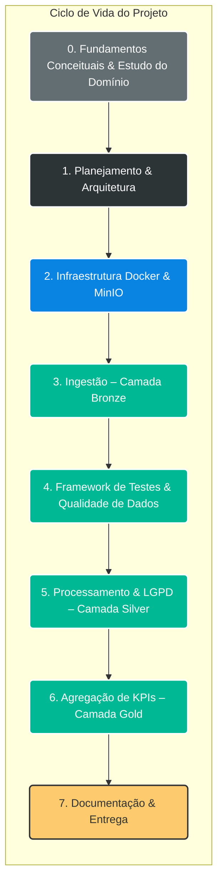
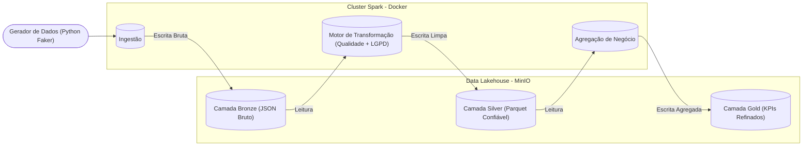

# 🔥 Data Masters – Pipeline de Engenharia de Dados End-to-End

<p align="center">
  <strong>Choose your language:</strong><br>
  <a href="README.eng.md">🇺🇸 English</a> |
  <a href="README.md">🇧🇷 Português</a> |
</p>

---


Este projeto simula um <b>ambiente corporativo real de Engenharia de Dados</b>, implementando um <b>pipeline End-to-End completo</b>, baseado na arquitetura <b>Lakehouse / Medallion</b>.
O objetivo principal foi construir uma <b>infraestrutura resiliente e independente de sistema operacional</b>, resolvendo problemas clássicos de compatibilidade entre <b>Apache Spark e Windows</b> por meio de <b>containerização total com Docker</b>.
Além disso, o projeto possui forte foco em <b>Qualidade de Dados e conformidade com a LGPD</b>.

## 📅 Ciclo de Vida do Projeto – Fases de Desenvolvimento

O projeto seguiu um ciclo estruturado para garantir que a <b>estabilidade da infraestrutura</b> e a <b>qualidade dos dados</b> fossem validadas antes da execução da lógica de negócio.



## 📖 Contexto Conceitual

> “A engenharia de dados é um conjunto de operações destinadas a criar interfaces e mecanismos para o fluxo e o acesso à informação.  
> São necessários especialistas dedicados — engenheiros de dados — para manter os dados disponíveis e utilizáveis por outros.  
> Em suma, os engenheiros de dados criam e operam a infraestrutura de dados da organização, preparando-a para análises posteriores por analistas e cientistas de dados.”
>
> — **AltexSoft**, *Data Engineering Concepts, Processes, and Tools* (citado em *Fundamentos de Engenharia de Dados*, O’Reilly)

Este projeto foi concebido para refletir essa definição na prática, com foco em **disponibilidade dos dados**, **confiabilidade**, **qualidade** e **prontidão para consumo analítico**.


## 🏗️ Visão Geral do Pipeline de Dados (Arquitetura)

Abaixo está a visão abstrata do fluxo de dados. O pipeline segue a <b>Arquitetura Medallion</b>, onde os dados são refinados progressivamente a cada camada.

---

## 🏛️ Contexto Arquitetural e Justificativa

A adoção da arquitetura **Lakehouse / Medallion** neste projeto **não foi arbitrária**. Ela decorre de um estudo comparativo entre arquiteturas modernas de dados, fundamentado nos critérios de **custo, complexidade operacional e amplitude de casos de uso**, conforme discutido por **James Serra** em *Decifrando Arquiteturas de Dados* (O’Reilly), além de conceitos consolidados em *Fundamentos de Engenharia de Dados* (O’Reilly).

### ❌ Por que não um Data Warehouse tradicional?
Embora Data Warehouses ofereçam **baixa latência e forte consistência**, apresentam **alto custo de licenciamento e manutenção**, além de **limitações para dados semiestruturados, não estruturados e workloads analíticos avançados**, como Machine Learning e Data Science.

### ❌ Por que não apenas um Data Lake?
Apesar do **baixo custo de armazenamento em objetos**, Data Lakes puros tendem a sofrer com **falta de governança, semântica e controle de qualidade**, levando ao conhecido fenômeno de *Data Swamp*, o que dificulta o consumo analítico confiável.

### ❌ Por que não Data Mesh ou Data Fabric?
Arquiteturas como **Data Mesh** e **Data Fabric** são conceitualmente robustas, porém exigem **alta maturidade organizacional**, **domínios bem definidos**, **times descentralizados** e um conjunto amplo de habilidades técnicas e culturais — classificados por Serra como arquiteturas de **alta complexidade operacional**. Esses requisitos extrapolariam o escopo e os objetivos deste projeto.

---

### 🏆 A Escolha: Lakehouse com Arquitetura Medallion

A arquitetura **Lakehouse**, estruturada no padrão **Medallion (Bronze, Silver e Gold)**, foi selecionada por representar o **melhor equilíbrio técnico** para o cenário corporativo simulado neste case:

1. **Custo-Eficiência:** Uso de armazenamento em objetos (MinIO/S3-compatible) com baixo custo e alta escalabilidade.
2. **Versatilidade Analítica:** Suporte tanto a BI tradicional quanto a workloads de Ciência de Dados e Machine Learning.
3. **Governança Pragmática:** Organização em camadas promove qualidade, rastreabilidade e evolução progressiva dos dados, sem a rigidez excessiva de um Data Warehouse legado.

Essa abordagem reflete práticas amplamente adotadas em ambientes corporativos modernos, conciliando **robustez arquitetural**, **simplicidade operacional** e **aderência aos objetivos do projeto**.

> *Embora a implementação tenha sido consolidada em um curto período, este projeto é resultado de mais de um ano de estudo contínuo e preparação em Engenharia de Dados, refletindo decisões arquiteturais conscientes e fundamentadas.*

---

## 🧠 Engenharia: Decisões Arquiteturais e Trade-offs

Este projeto foi desenhado simulando um cenário real, onde cada escolha técnica visou resolver um problema específico de negócio ou infraestrutura.

| Decisão | O Problema | A Solução Adotada | Por que não a alternativa? |
| :--- | :--- | :--- | :--- |
| **Containerização Total** | O ambiente Windows frequentemente conflita com bibliotecas Hadoop/Spark nativas do Linux (`winutils.exe`). | **Docker & Docker Compose.** Criamos um ambiente Linux isolado que roda o Spark de forma nativa. | Rodar localmente no Windows traria instabilidade e dificultaria a reprodução do projeto em outras máquinas ("Works on my machine"). |
| **MinIO (S3)** | Necessidade de simular um Data Lake em nuvem sem gerar custos de AWS/Azure. | **MinIO Server.** Ele utiliza exatamente a mesma API do Amazon S3 (`boto3` / `s3a://`). | Usar o sistema de arquivos local (`file://`) não prepararia o código para uma migração real para a nuvem (Cloud Native). |
| **Orquestração Customizada** | Pipelines de dados precisam de tratamento de erro, logs e dependência entre tarefas. | **Script Python (`pipeline.py`).** Controle total do fluxo de execução com `try/catch` e logs estruturados. | **Por que não Airflow neste momento?** Para este escopo, subir um cluster Airflow (Webserver + Scheduler + Worker) adicionaria um *overhead* de infraestrutura desnecessário. A lógica atual é facilmente portável para uma DAG no futuro. |
| **Formato Parquet** | Armazenamento de Big Data requer compressão e leitura eficiente. | **Apache Parquet (Snappy).** Padrão de mercado para Analytics. | CSVs não mantêm schema (tipagem) e são lentos para leitura. O Parquet garante performance na camada Silver/Gold. |

---
## 🔮 Roadmap e Melhorias Futuras

O desenvolvimento de software é iterativo. Abaixo, listo as evoluções planejadas para levar este projeto ao próximo nível de maturidade (Enterprise Level).

* [ ] **Migração para Delta Lake:**
    * *Objetivo:* Implementar transações ACID e *Time Travel*.
    * *Contexto:* Atualmente utilizo **Parquet** padrão para demonstrar o domínio da manipulação de arquivos brutos no Spark, mas a evolução natural do Lakehouse é o formato Delta para garantir *Schema Enforcement*.
* [ ] **Orquestração com Airflow:**
    * *Objetivo:* Monitoramento visual, retries automáticos e backfilling.
    * *Contexto:* A lógica de orquestração já está desacoplada no script `src/pipeline.py`, o que facilita a migração para `PythonOperator` ou `SparkSubmitOperator` dentro de uma DAG do Airflow.
* [ ] **CI/CD (GitHub Actions):**
    * *Objetivo:* Automatizar a execução dos testes (`pytest`) a cada Push ou Pull Request.
* [ ] **Dashboarding:**
    * *Objetivo:* Conectar o Power BI ou Metabase diretamente ao MinIO (via Thrift Server ou Presto) para consumir a camada Gold.

---

## 🛡️ Diferenciais do Projeto
### 1. Qualidade de Dados como Prioridade

Diferente de pipelines tradicionais que apenas movimentam dados, este projeto impõe portões explícitos de qualidade.

Testes Unitários: lógica de transformação validada com pytest

Validação em Runtime: valores críticos nulos ou negativos são bloqueados antes da promoção para Silver

### 2. Privacidade & Conformidade com LGPD

Implementação prática do conceito Privacy by Design.

Camada Bronze: dados brutos e sensíveis

Camada Silver: dados anonimizados

Exemplos:

CPF → *** *** ***-XX

Cartão de Crédito → **** **** **** 1234

### 3. Infraestrutura Totalmente Containerizada

O mesmo pipeline executa de forma idêntica em:

Windows

Linux

Ambientes Cloud

Eliminando o clássico problema: <b>“na minha máquina funciona”</b>.


## 🚀 Como Executar o Projeto
### Pré-requisitos

Docker Desktop (em execução)

Git

### Clonar o repositório
```
git clone https://github.com/arthurgmv/projeto_data_masters.git
cd projeto_data_masters
```
### Configurar Variáveis de Ambiente (Passo Crucial) ⚠️
O projeto utiliza variáveis de ambiente para garantir a segurança das credenciais. Você deve criar um arquivo `.env` baseado no exemplo fornecido.
```
# Linux / Mac
cp .env.example .env

<<<<<<< HEAD
### Start the infrastructure
=======
# Windows (Prompt de Comando / PowerShell)
copy .env.example .env
```

### Subir a infraestrutura
>>>>>>> d297535b07ef79b40708cca787d5e5e39388e51c
```
docker-compose up -d
```
### Instalar dependências no cluster Spark
```
docker exec spark_master pip install boto3 python-dotenv pytest faker colorama pyspark
```
### Executar testes de qualidade de dados
```
docker exec spark_master pytest -v /app/tests/
```
### Executar o pipeline completo
```
docker exec spark_master python3 src/pipeline.py
```
## 📊 Acesso aos Dados

<b>Console do MinIO (Data Lake)</b>
http://localhost:9001

<b>Usuário</b>: admin

<b>Senha</b>: minioadmin

<b>Spark Master UI</b>
http://localhost:8080

## 📞 Contato

[]([https://www.linkedin.com/in/arthur-gabriel-de-menezes-viana-4b0690201/](https://www.linkedin.com/in/arthur-gabriel-de-menezes-viana-1223a6239/))
