# 🔥 Data Masters – End-to-End Data Engineering Pipeline

<p align="center">
  <strong>Choose your language:</strong><br>
  <a href="README.md">🇺🇸 English</a> |
  <a href="README.pt-BR.md">🇧🇷 Português</a>
</p>

---


This project simulates a **real-world corporate Data Engineering environment**, implementing a fully **End-to-End data pipeline** based on the **Lakehouse / Medallion Architecture**.

The main goal was to build a **resilient and OS-agnostic infrastructure**, overcoming common **Apache Spark + Windows compatibility issues** through **full Docker containerization**.  
Additionally, the project strongly focuses on **Data Quality** and **LGPD (Brazilian GDPR) compliance**.

---

## 📅 Project Lifecycle – Development Phases

The project followed a structured lifecycle to ensure that **infrastructure stability** and **data quality** were validated before business logic execution.

```mermaid
graph TD
    classDef planning fill:#2d3436,stroke:#fff,stroke-width:2px,color:#fff;
    classDef infra fill:#0984e3,stroke:#fff,stroke-width:2px,color:#fff;
    classDef code fill:#00b894,stroke:#fff,stroke-width:2px,color:#fff;
    classDef deliver fill:#fdcb6e,stroke:#333,stroke-width:2px,color:#333;

    subgraph Timeline [Project Lifecycle]
        direction TB
        A(1. Planning & Architecture):::planning --> B(2. Docker Infrastructure & MinIO):::infra
        B --> C(3. Ingestion – Bronze Layer):::code
        C --> D(4. Testing Framework & Data Quality):::code
        D --> E(5. Processing & LGPD – Silver Layer):::code
        E --> F(6. KPI Aggregation – Gold Layer):::code
        F --> G(7. Documentation & Delivery):::deliver
    end
```


---

## 🏗️ Data Pipeline Overview (Architecture)

Below is the abstract view of the data flow. The pipeline follows the Medallion Architecture, where data is progressively refined across layers.


## 🛠️ Tech Stack & Technical Decisions

| Technology                  | Role              | Technical Decision                                                  |
| --------------------------- | ----------------- | ------------------------------------------------------------------- |
| **Docker & Docker Compose** | Infrastructure    | Full environment isolation and elimination of OS-related conflicts. |
| **Apache Spark**            | Processing Engine | Distributed processing for scalable Big Data workloads.             |
| **MinIO**                   | Data Lake         | S3-compatible object storage simulating a real cloud environment.   |
| **Python 3.12**             | Language          | Pipeline orchestration and auxiliary scripting.                     |
| **Pytest**                  | Data Quality / QA | Unit tests to prevent bad data propagation.                         |
| **Parquet**                 | File Format       | Columnar storage optimized for analytics (Silver & Gold layers).    |

## 🛡️ Project Differentiators

### 1. Data Quality First

Unlike traditional pipelines that only move data, this project enforces explicit quality gates.

Unit Tests: Transformation logic validated with pytest.

Runtime Validation: Critical null or negative values are blocked before promotion to Silver.

### 2. Privacy & LGPD Compliance

Practical implementation of Privacy by Design.

Bronze Layer: Raw and restricted data.

Silver Layer: Anonymized data:

CPF: ***.***.***-XX

Credit Card: **** **** **** 1234

### 3. Fully Containerized Infrastructure

The same pipeline runs identically on:

Windows laptops

Linux servers

Cloud environments

Eliminating the classic “works on my machine” issue.

## 🚀 How to Run the Project
Prerequisites

Docker Desktop (running)

Git

Steps

### Clone the repository
```
git clone https://github.com/arthurgmv/projeto_data_masters.git
cd projeto_data_masters
```

### Start the infrastructure
```
docker-compose up -d
```
### Install dependencies inside the Spark cluster
```
docker exec spark_master pip install boto3 python-dotenv pytest faker colorama pyspark
```
### Run data quality tests
```
docker exec spark_master pytest -v /app/tests/
```
### Execute the full pipeline
```
docker exec spark_master python3 src/pipeline.py
```
## 📊 Accessing Results

<b>MinIO Console (Data Lake)</b>: http://localhost:9001

<b>User</b>: 
minioadmin
<b>Password</b>: 
minioadmin

<b>Spark Master UI</b>: http://localhost:8080

## 📞 Contact

[](https://www.linkedin.com/in/arthur-gabriel-de-menezes-viana-1223a6239/)


