# 🔥 Data Masters – End-to-End Data Engineering Pipeline

<p align="center">
  <strong>Choose your language:</strong><br>
  <a href="README.md">🇺🇸 English</a> |
  <a href="README.pt-BR.md">🇧🇷 Português</a>
</p>

---


This project simulates a **real-world corporate Data Engineering environment**, implementing a fully **End-to-End data pipeline** based on the **Lakehouse / Medallion Architecture**.

The main goal was to build a **resilient and OS-agnostic infrastructure**, overcoming common **Apache Spark + Windows compatibility issues** through **full Docker containerization**.  
Additionally, the project strongly focuses on **Data Quality** and **LGPD (Brazilian GDPR) compliance**.

---

## 📅 Project Lifecycle – Development Phases

The project followed a structured lifecycle to ensure that **infrastructure stability** and **data quality** were validated before business logic execution.

```mermaid
graph TD
    classDef study fill:#636e72,stroke:#fff,stroke-width:2px,color:#fff;
    classDef planning fill:#2d3436,stroke:#fff,stroke-width:2px,color:#fff;
    classDef infra fill:#0984e3,stroke:#fff,stroke-width:2px,color:#fff;
    classDef code fill:#00b894,stroke:#fff,stroke-width:2px,color:#fff;
    classDef deliver fill:#fdcb6e,stroke:#333,stroke-width:2px,color:#333;

    subgraph Timeline [Project Lifecycle]
        direction TB
        Z(0. Conceptual Foundation & Study):::study --> A(1. Planning & Architecture):::planning
        A --> B(2. Docker Infrastructure & MinIO):::infra
        B --> C(3. Ingestion – Bronze Layer):::code
        C --> D(4. Testing Framework & Data Quality):::code
        D --> E(5. Processing & LGPD – Silver Layer):::code
        E --> F(6. KPI Aggregation – Gold Layer):::code
        F --> G(7. Documentation & Delivery):::deliver
    end
```


---
## 📖 Conceptual Background

> *“Data engineering is a set of operations aimed at creating interfaces and mechanisms for the flow and access of information.  
> It takes dedicated specialists — data engineers — to maintain data so that it remains available and usable by others.  
> In short, data engineers set up and operate the organization’s data infrastructure, preparing it for further analysis by data analysts and scientists.”*  
>
> — **AltexSoft**, *Data Engineering Concepts, Processes, and Tools*  
> *(Cited in* **Fundamentals of Data Engineering**, O’Reilly*)*

This project was designed to reflect this definition in practice, with a strong focus on **data availability**, **reliability**, **quality**, and **readiness for analytical consumption**.

## 🏗️ Data Pipeline Overview (Architecture)

Below is the abstract view of the data flow. The pipeline follows the Medallion Architecture, where data is progressively refined across layers.


## 🧠 Engineering: Architectural Decisions & Trade-offs
This project was designed to simulate a real-world scenario, where each technical decision was made to solve a specific business or infrastructure problem.

| Decision                  | The Problem                                                                                        | Adopted Solution                                                                                                    | Why not the alternative?                                                                                                                                                                                             |
| :------------------------ | :------------------------------------------------------------------------------------------------- | :------------------------------------------------------------------------------------------------------------------ | :------------------------------------------------------------------------------------------------------------------------------------------------------------------------------------------------------------------- |
| **Full Containerization** | The Windows environment often conflicts with native Linux Hadoop/Spark libraries (`winutils.exe`). | **Docker & Docker Compose.** We created an isolated Linux environment where Spark runs natively.                    | Running Spark directly on Windows would introduce instability and make the project harder to reproduce across different machines (“works on my machine” issue).                                                      |
| **MinIO (S3)**            | The need to simulate a cloud-based Data Lake without incurring AWS/Azure costs.                    | **MinIO Server.** It uses the exact same API as Amazon S3 (`boto3` / `s3a://`).                                     | Using the local filesystem (`file://`) would not prepare the codebase for a real cloud migration (Cloud Native approach).                                                                                            |
| **Custom Orchestration**  | Data pipelines require error handling, logging, and task dependencies.                             | **Python script (`pipeline.py`).** Full control over execution flow with `try/catch` blocks and structured logging. | **Why not Airflow yet?** For this scope, deploying a full Airflow stack (Webserver + Scheduler + Worker) would add unnecessary infrastructure overhead. The current logic is easily portable to a DAG in the future. |
| **Parquet File Format**   | Big Data storage requires compression and efficient read performance.                              | **Apache Parquet (Snappy).** Industry standard for analytics workloads.                                             | CSV files do not enforce schema (data types) and are inefficient for analytical reads. Parquet ensures high performance in the Silver and Gold layers.                                                               |

## 🔮 Roadmap & Future Improvements

Software development is iterative. Below are the planned enhancements to bring this project to the next level of maturity (Enterprise Level).

* [ ] **Migration to Delta Lake**
    * *Goal:* Enable ACID transactions and *Time Travel*.
    * *Context:* The project currently uses standard **Parquet** to demonstrate hands-on control over raw Spark file handling. However, the natural evolution of a Lakehouse architecture is Delta Lake, which provides *Schema Enforcement* and transactional guarantees.

* [ ] **Orchestration with Airflow**
    * *Goal:* Visual monitoring, automated retries, and backfilling.
    * *Context:* The orchestration logic is already decoupled within the `src/pipeline.py` script, making it straightforward to migrate to `PythonOperator` or `SparkSubmitOperator` inside an Airflow DAG.

* [ ] **CI/CD (GitHub Actions)**
    * *Goal:* Automatically run unit tests (`pytest`) on every push or pull request.

* [ ] **Dashboarding**
    * *Goal:* Connect Power BI or Metabase directly to MinIO (via Thrift Server or Presto) to consume data from the Gold layer.

## 🛡️ Project Differentiators

### 1. Data Quality First

Unlike traditional pipelines that only move data, this project enforces explicit quality gates.

Unit Tests: Transformation logic validated with pytest.

Runtime Validation: Critical null or negative values are blocked before promotion to Silver.

### 2. Privacy & LGPD Compliance

Practical implementation of Privacy by Design.

Bronze Layer: Raw and restricted data.

Silver Layer: Anonymized data:

CPF: *** *** ***-XX

Credit Card: **** **** **** 1234

### 3. Fully Containerized Infrastructure

The same pipeline runs identically on:

Windows laptops

Linux servers

Cloud environments

Eliminating the classic “works on my machine” issue.

## 🚀 How to Run the Project
Prerequisites

Docker Desktop (running)

Git

Steps

### Clone the repository
```
git clone https://github.com/arthurgmv/projeto_data_masters.git
cd projeto_data_masters
```

### Start the infrastructure
```
docker-compose up -d
```
### Install dependencies inside the Spark cluster
```
docker exec spark_master pip install boto3 python-dotenv pytest faker colorama pyspark
```
### Run data quality tests
```
docker exec spark_master pytest -v /app/tests/
```
### Execute the full pipeline
```
docker exec spark_master python3 src/pipeline.py
```
## 📊 Accessing Data

<b>MinIO Console (Data Lake)</b>: http://localhost:9001

<b>User</b>: 
admin
<b>Password</b>: 
minioadmin

<b>Spark Master UI</b>: http://localhost:8080

## 📞 Contact

[](https://www.linkedin.com/in/arthur-gabriel-de-menezes-viana-1223a6239/)


