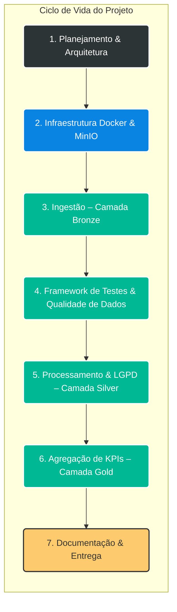
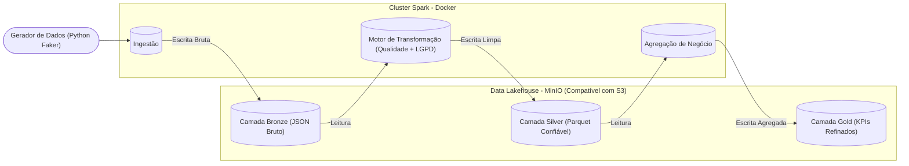

# 🔥Data Masters – Pipeline de Engenharia de Dados End-to-End

<p align="center">
  <strong>Choose your language:</strong><br>
  <a href="README.md">🇺🇸 English</a> |
  <a href="README.pt-BR.md">🇧🇷 Português</a> |
</p>

---


Este projeto simula um <b>ambiente corporativo real de Engenharia de Dados</b>, implementando um <b>pipeline End-to-End completo</b>, baseado na arquitetura <b>Lakehouse / Medallion</b>.
O objetivo principal foi construir uma <b>infraestrutura resiliente e independente de sistema operacional</b>, resolvendo problemas clássicos de compatibilidade entre <b>Apache Spark e Windows</b> por meio de <b>containerização total com Docker</b>.
Além disso, o projeto possui forte foco em <b>Qualidade de Dados e conformidade com a LGPD</b>.

## 📅 Ciclo de Vida do Projeto – Fases de Desenvolvimento

O projeto seguiu um ciclo estruturado para garantir que a <b>estabilidade da infraestrutura</b> e a <b>qualidade dos dados</b> fossem validadas antes da execução da lógica de negócio.



## 🏗️ Visão Geral do Pipeline de Dados (Arquitetura)

Abaixo está a visão abstrata do fluxo de dados. O pipeline segue a <b>Arquitetura Medallion</b>, onde os dados são refinados progressivamente a cada camada.

---


---

## 🛠️ Stack Tecnológica & Decisões Técnicas

| Tecnologia                  | Papel                  | Decisão Técnica                                                           |
| --------------------------- | ---------------------- | ------------------------------------------------------------------------- |
| **Docker & Docker Compose** | Infraestrutura         | Isolamento completo do ambiente e eliminação de conflitos entre sistemas. |
| **Apache Spark**            | Motor de Processamento | Processamento distribuído para workloads de Big Data.                     |
| **MinIO**                   | Data Lake              | Storage compatível com S3 simulando ambiente cloud real.                  |
| **Python 3.12**             | Linguagem              | Orquestração do pipeline e scripts auxiliares.                            |
| **Pytest**                  | Qualidade de Dados     | Testes unitários para evitar propagação de dados incorretos.              |
| **Parquet**                 | Formato de Arquivo     | Armazenamento colunar otimizado para analytics (Silver & Gold).           |

## 🛡️ Diferenciais do Projeto
### 1. Qualidade de Dados como Prioridade

Diferente de pipelines tradicionais que apenas movimentam dados, este projeto impõe portões explícitos de qualidade.

Testes Unitários: lógica de transformação validada com pytest

Validação em Runtime: valores críticos nulos ou negativos são bloqueados antes da promoção para Silver

### 2. Privacidade & Conformidade com LGPD

Implementação prática do conceito Privacy by Design.

Camada Bronze: dados brutos e sensíveis

Camada Silver: dados anonimizados

Exemplos:

CPF → *** *** ***-XX

Cartão de Crédito → **** **** **** 1234

### 3. Infraestrutura Totalmente Containerizada

O mesmo pipeline executa de forma idêntica em:

Windows

Linux

Ambientes Cloud

Eliminando o clássico problema: <b>“na minha máquina funciona”</b>.

## 🚀 Como Executar o Projeto
Pré-requisitos

Docker Desktop (em execução)

Git

## Clonar o repositório
```
git clone https://github.com/arthurgmv/projeto_data_masters.git
cd projeto_data_masters
```

## Subir a infraestrutura
```
docker-compose up -d
```
## Instalar dependências no cluster Spark
```
docker exec spark_master pip install boto3 python-dotenv pytest faker colorama pyspark
```
## Executar testes de qualidade de dados
```
docker exec spark_master pytest -v /app/tests/
```
## Executar o pipeline completo
```
docker exec spark_master python3 src/pipeline.py
```
## 📊 Acesso aos Resultados

<b>Console do MinIO (Data Lake)</b>
http://localhost:9001

<b>Usuário</b>: minioadmin

<b>Senha</b>: minioadmin

<b>Spark Master UI</b>
http://localhost:8080

## 📞 Contato

[]([https://www.linkedin.com/in/arthur-gabriel-de-menezes-viana-4b0690201/](https://www.linkedin.com/in/arthur-gabriel-de-menezes-viana-1223a6239/))
